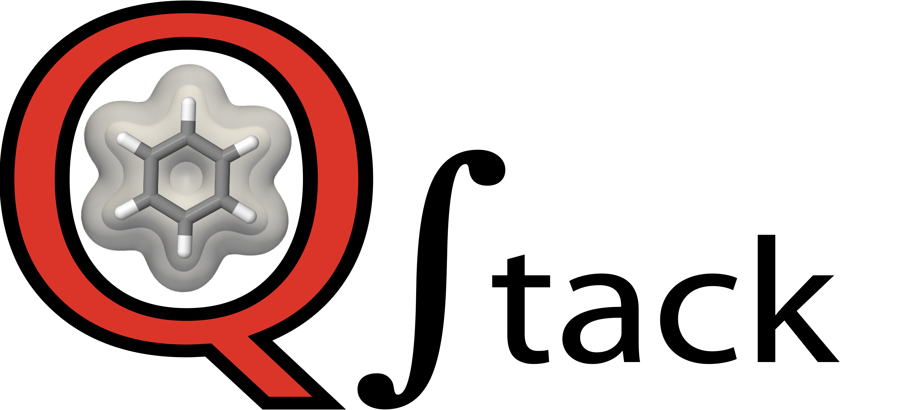
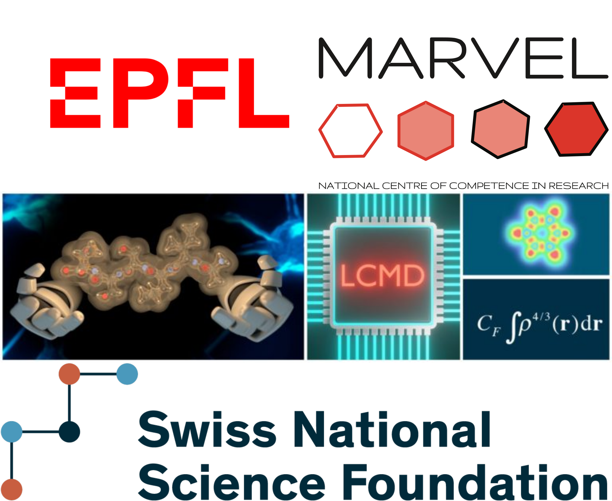

[](https://lifecycle.r-lib.org/articles/stages.html#experimental)
==============================================
Q-stack
==============================================


## Contents
* [Contents](#Contents-)
* [About](#about-)
* [Install](#install-)
* [Demo](#demo-)
* [Acknowledgements](#Acknowledgements-)

## About [↑](#contents)

Q-stack is a stack of codes for dedicated pre- and post-processing tasks for Quantum Machine Learning (QML). It is a work in progress, and will be updated soon.

For now, we link to the relevant packages that will be incorporated (among others):
- https://github.com/lcmd-epfl/azo-xcite-tools
- https://github.com/lcmd-epfl/SPAHM
- https://github.com/lcmd-epfl/RHO-Decomposition
- https://github.com/lcmd-epfl/ml-density
- https://github.com/lcmd-epfl/OTPD-basis

Stay tuned for updates!

## Install [↑](#contents)

The installation of the library for python use can be done executing the following commands:

```
python -m pip install git+https://github.com/lcmd-epfl/Q-stack.git
```
## Demo [↑](#contents)


https://user-images.githubusercontent.com/13234531/171138448-1ce91fa1-6600-4cb1-90fc-0758937e2d75.mp4


## Acknowledgements [↑](#contents)
The authors of Q-stack acknowledge the National Centre of Competence in Research (NCCR) "Materials' Revolution: Computational Design and Discovery of Novel Materials (MARVEL)" of the Swiss National Science Foundation (SNSF, grant number 182892) and the European Research Council (ERC, grant agreement no 817977).


